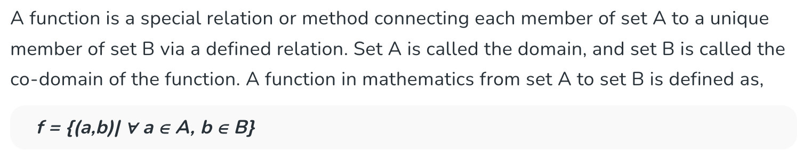
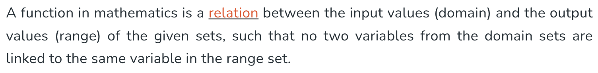
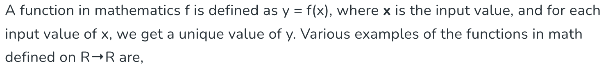
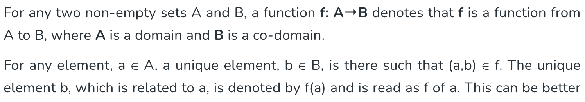
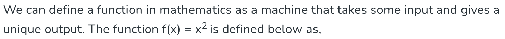
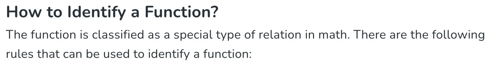

# The Surprising Power of "Bad" Tutorials: Why Repetitive, Messy Content Sometimes Wins for Beginners

***by groda***

***April 13, 2026***

A few years ago, a CS student interning with us casually said, “It’s on GeeksForGeeks,” as if that settled the matter. I was surprised—she was quoting a site I saw primarily as an SEO powerhouse like it was the authoritative bible of computer science. Many people experience the same thing: you Google a coding or math question, notice the same site popping up first (or near the top) repeatedly, and suddenly it feels like the default source. Repeated exposure creates trust, even when the content quality varies wildly.

GeeksforGeeks (often abbreviated as GFG) used to consistently rank at or near the top of Google search results for a huge range of coding, data structures, algorithms, interview questions, and even some math-related programming topics. This wasn't just "great SEO"—it was the result of several factors working together over many years.

Here's the breakdown of what historically gave them such strong, consistent visibility:

- Massive scale and coverage — They have thousands (likely tens of thousands) of articles/pages covering virtually every common coding problem, algorithm, data structure, language-specific topic, company interview experience, etc. This creates extremely strong topical authority in the "programming/competitive coding/interview prep" niche. Google rewards sites that deeply cover a subject area comprehensively.

- Keyword optimization and exact-match targeting — Many pages are titled and structured around precise search queries people type (e.g., "reverse a linked list", "Dijkstra's algorithm", "Longest Common Subsequence"). This on-page SEO alignment with search intent helped them match queries very directly.

- High volume of backlinks and domain authority — Over time, because they appeared everywhere in search results and were widely referenced in forums, tutorials, student notes, Reddit, Quora, etc., they built a very strong backlink profile. High domain authority (a signal of trustworthiness) helped them rank even when content quality varied.

- User signals and click-through behavior — When people repeatedly clicked GFG links for years (because it was already ranking high and often had code + explanation in one place), Google interpreted this as a positive engagement signal, reinforcing the rankings in a feedback loop.

- Longevity and consistency — The site has been around since ~2008–2010 and steadily expanded content, giving it age-related trust signals and a huge indexed footprint.

Many developers complained about this dominance for years—calling it a "content farm" with repetitive, sometimes low-quality or copied explanations—yet it kept ranking because the above factors outweighed the quality issues in Google's older algorithms.

Even though the situation has changed significantly as of 2025 due to Google policies, the old dominance left a lasting mark. Google hit GeeksforGeeks with a major manual action/penalty (likely around March–April 2025, tied to core updates and spam policies). They lost 70–90% of organic traffic very suddenly, with many pages deindexed or tanked in rankings. The reasons included "thin content" and spam violations, but analysts often point to topical drift—they expanded far beyond core CS/coding topics into unrelated areas (celebrity gossip, general lifestyle, etc.), diluting their once-strong focus and triggering Google's quality filters.

This was one of the more dramatic examples of Google's push (especially post-Helpful Content Updates and 2024–2025 core updates) to demote low-value, mass-produced, or off-topic content—even on established domains. As of early 2026, their blanket "always first" era is largely over for many queries, though some remnant pages in their core niche still hold on.

One such survivor is the page that still ranks on the first page (around #7) for the simple query "what is a function". I was appalled by how the page is of bad quality, repetitive and unstructured (https://www.geeksforgeeks.org/maths/what-is-a-function/).

- "A function is a special relation or method..." 

- and then "A function in mathematics is a relation between ..." 

- and again "A function in mathematics f is defined as y = f(x)" ("a function in mathematics f", what's that for an ordering of words?) 

- and yet again "Condition for a Function. For any two non-empty sets A and B, a function f: A→B denotes that f is a function..." 

- "We can define a function in mathematics as a machine that takes some input ..."

- Noooooo "How to Identify a Function? The function is classified as a special type of relation in math...."  

This is a *really* bad quality article. It screams low-effort, mass-produced content—often churned out quickly (possibly with templated writing under tight deadlines or low wages). Yet it clings to page 1 thanks to lingering domain trust in the CS/math-for-programming niche, search intent from Indian students prepping for exams and placements, and the simple fact that Google’s systems are not binary.

That frustration led me to a surprising realization: maybe students *like* bad, unstructured, repetitive content with typos. It speaks to them because it's at their level. Many "didactic" sites feel boring or too high-level. Repetitive explanations hammer the same point from multiple angles ("a function is a relation... also a special method... y = f(x)..."), which can feel reassuring when you're confused. It mimics how beginners think: circling around an idea until it clicks, rather than a concise, elegant one-shot explanation that assumes prior knowledge.

This isn't unique to that one page. Other GFG articles, like the one on the derivative of a function, show the same heavy circling—reframing "derivative" as rate of change, slope, limit of difference quotient, and tangent repeatedly. Even the more list-heavy "Derivative Formulas" page has its mechanical repetition. And the "Arithmetic Mean" article under their DSA section starts with the basic average but quickly pivots to inserting N means in an arithmetic progression, with heavy redundant "interesting facts" bullets. These pages feel disjointed or formula-dump-ish to experts, yet they remain accessible entry points for novices.

The learning journey is almost comically predictable. Beginners lean hard on GFG because it shows up first, feels practical for exams and interviews, and provides quantity over perfection. Then, as experience grows, many graduate to LeetCode for cleaner problem-solving, Codeforces for competitive depth, or more polished resources—and suddenly start criticizing GFG as a "content farm." It's a rite of passage: the training wheels that once felt like a lifesaver later look sloppy. Even harsh critics often admit they used it heavily at the start.

But here's the key insight: what experts call flaws—repetition, redundancy, awkward phrasing, lack of polish—are often **features** for true beginners. They provide psychological safety, multiple entry points, and gentle reinforcement when a single elegant explanation would intimidate or confuse.

That realization led me to an idea: perhaps these "imperfect" qualities deserved to be turned into a deliberate approach. What if we stopped apologizing for repetition and instead celebrated it as a powerful pedagogical tool? This thought eventually lead me to draft the following manifesto.

## Manifesto for Beginner Tutorials: Embrace Repetition from Multiple Angles

1. Beginners don't arrive with a perfect mental model—they circle, probe, and poke.  
A single elegant explanation assumes the reader already has the scaffolding. Repetition lets them approach the same concept sideways: "It's a relation... it's like a machine that takes input and gives output... here's y = f(x)... think of it as mapping every A to exactly one B..." Each pass builds familiarity without demanding prior fluency. It's reassuring chaos that mirrors how confusion actually feels.

2. Redundancy isn't waste—it's reinforcement.  
Research on learning (from child development to adult skill acquisition) consistently shows repetition strengthens neural pathways, boosts retention, and builds confidence. When a tutorial says the same thing three slightly different ways, it's not lazy—it's deliberate practice for the brain. It helps transfer knowledge from shaky short-term grasp to intuitive recall, especially when the repetitions vary phrasing, examples, or analogies.

3. Multiple angles = multiple entry points.  
One person clicks with the formal definition ("a special relation"), another with the code-like intuition ("a method that maps inputs to outputs"), a third with the visual (domain → range arrows). By hammering from different directions, the tutorial lowers the barrier: if one angle doesn't land, the next might. This is especially powerful in programming/math, where concepts like functions feel abstract until you've seen them reframed a few times.

4. It mimics natural learning, not polished lecturing.  
Kids learn by repeating songs, stories, or games endlessly. Adults re-watch tutorials or re-read Stack Overflow answers. Beginners thrive on "circling around until it clicks" rather than a linear march. Concise, high-level resources (official docs, advanced texts) can feel like being dropped into the deep end—intimidating when you're still figuring out how to swim.

5. Accessibility trumps elegance at the start.  
The goal for true beginners isn't deep mastery on first read—it's "get unstuck and move forward." Repetitive, low-frills explanations provide safety nets: if you glaze over one paragraph, the next one rephrases it gently. This reduces frustration, dropout risk, and the infamous "tutorial hell" paralysis. Once confidence builds, learners naturally seek cleaner, more concise resources.

6. It's not forever—it's scaffolding.  
The manifesto isn't saying all content should be repetitive forever. It's targeted: use this style for the onboarding phase. As learners progress, they "graduate" to spaced repetition (reviewing at increasing intervals), deliberate practice on problems, or minimalist references. The repetitive hammering is training wheels—essential early, but gladly shed later.

In short: for beginner tutorials, repetition from multiple angles isn't a flaw—it's the feature. It meets learners where they are: confused, tentative, and in need of gentle, forgiving reinforcement rather than a single brilliant flash of insight.

### A Quick Note on the Science Behind Repetition

This idea isn’t just anecdotal. In pedagogical research, the **spacing effect** (one of the most robust findings in cognitive science) shows that repeated exposure to material—especially when spaced out or approached from varied angles—strengthens long-term retention far better than massed, one-shot explanations. Multiple slightly different framings help learners build richer mental models and reduce the intimidation of abstract concepts. Even in machine learning, repetition plays a similar foundational role: models learn robust patterns by seeing the same concepts across many varied examples during training (though excessive identical repetition can lead to overfitting). In both human learning and artificial systems, thoughtful repetition isn’t redundancy—it’s how solid understanding is forged.

This approach explains why certain "imperfect" resources (like the GFG pages we examined) retain loyalty among newcomers. They deliver psychological safety and incremental wins that more polished ones sometimes skip. When we write beginner CS and math tutorials with this manifesto in mind, we’ll likely see fewer people bouncing off the first explanation and more sticking around to build real momentum.
